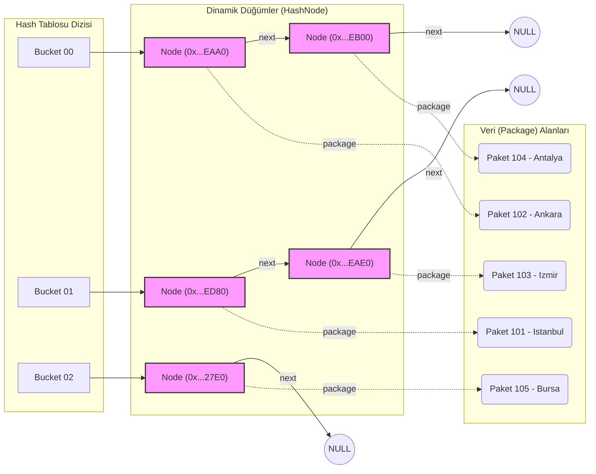

# Lojistik Ağı Yönetim Sistemi - Bellek İzleme Raporu

Aşağıdaki rapor, sistemin çalışma zamanında (runtime) **dinamik bellek yönetimi (malloc/free)** ile oluşturduğu düğümlerin (Node), paketlerin ve Graf rotalarının gerçek zamanlı RAM adreslerini (`0x...` formatında) göstermektedir. Ayrıca sistemin O(1) hızında arama yapabildiğini kanıtlayan Hash eşleşmesi ve Derinlik Öncelikli Arama (DFS) lojistik güzergahı da aşağıda sunulmuştur.

> **NOT:** Raporda görülen `0x00000...` formatındaki adresler, işletim sisteminin bu çalışmada programımıza özel olarak ayırdığı (Heap) bellek hücreleridir. Her çalıştırmada bu adresler benzersiz olacaktır.

## 1. Hash Tablosu (Hash Table) Bellek İzleme Raporu
Çarpım Yöntemi (Multiplication Method) ile paketler ID'lerine göre Hash tablosuna eklenmiş ve çakışma durumunda bağlı liste (Chaining) kullanılarak zincirlenmiştir:

```text
========== HASH TABLOSU BELLEK IZLEME RAPORU ==========
Bucket [00]: [Paket ID: 102 | Node Adres: 000002854BCAEAA0 | Paket Adres: 000002854BCABC10] -> [Paket ID: 104 | Node Adres: 000002854BCAEB00 | Paket Adres: 000002854BCB2510] -> NULL
Bucket [01]: [Paket ID: 101 | Node Adres: 000002854BCAED80 | Paket Adres: 000002854BCB0390] -> [Paket ID: 103 | Node Adres: 000002854BCAEAE0 | Paket Adres: 000002854BCB2460] -> NULL
Bucket [02]: [Paket ID: 105 | Node Adres: 000002854BCB27E0 | Paket Adres: 000002854BCB25C0] -> NULL
=======================================================
```

### 1.1 Teknik Tablo (5 Veri Girişi Sonrası RAM Durumu)

| Paket ID | Hedef Şehir | Kova (Bucket) | Düğüm (HashNode) Adresi | Veri (Package) Adresi | Sonraki Düğüm (Next Pointer) |
|:---:|:---|:---:|:---|:---|:---|
| **102** | Ankara | `Bucket [00]` | `0x000002854BCAEAA0` | `0x000002854BCABC10` | `0x000002854BCAEB00` |
| **104** | Antalya | `Bucket [00]` | `0x000002854BCAEB00` | `0x000002854BCB2510` | `NULL` |
| **101** | Istanbul | `Bucket [01]` | `0x000002854BCAED80` | `0x000002854BCB0390` | `0x000002854BCAEAE0` |
| **103** | Izmir | `Bucket [01]` | `0x000002854BCAEAE0` | `0x000002854BCB2460` | `NULL` |
| **105** | Bursa | `Bucket [02]` | `0x000002854BCB27E0` | `0x000002854BCB25C0` | `NULL` |

### 1.2 Şematik Gösterim (Pointer Bağlantıları)

Aşağıdaki şemada, RAM üzerinde dinamik olarak oluşturulmuş işaretçi (pointer) yapısının **Zincirleme (Chaining)** yöntemiyle birbirine nasıl bağlandığı gösterilmiştir:



## 2. Lojistik Ağı (Graf) Komşuluk Listesi Bellek Raporu
Şehirler arası rotalar, sadece var olan rotalar için bellek ayrılarak optimizasyon sağlanmış (Adjacency List) şekilde RAM'de tutulmaktadır:

```text
========= GRAF (KOMSULUK LISTESI) BELLEK RAPORU =========
Sehir: Istanbul        | Düğüm Adresi: 000002854BCAE4B0
    +----( 150 km )----> [Hedef ID: 3] | Baglanti Adresi: 000002854BCAEBA0
    +----( 480 km )----> [Hedef ID: 2] | Baglanti Adresi: 000002854BCAED60
    +----( 450 km )----> [Hedef ID: 1] | Baglanti Adresi: 000002854BCAEDA0
Sehir: Ankara          | Düğüm Adresi: 000002854BCAE500
    +----( 500 km )----> [Hedef ID: 4] | Baglanti Adresi: 000002854BCAEAC0
    +----( 450 km )----> [Hedef ID: 0] | Baglanti Adresi: 000002854BCAEB60
Sehir: Izmir           | Düğüm Adresi: 000002854BCAE320
    +----( 460 km )----> [Hedef ID: 4] | Baglanti Adresi: 000002854BCAECE0
    +----( 480 km )----> [Hedef ID: 0] | Baglanti Adresi: 000002854BCAEA80
Sehir: Bursa           | Düğüm Adresi: 000002854BCAE370
    +----( 150 km )----> [Hedef ID: 0] | Baglanti Adresi: 000002854BCAEDC0
Sehir: Antalya         | Düğüm Adresi: 000002854BCAE7D0
    +----( 460 km )----> [Hedef ID: 2] | Baglanti Adresi: 000002854BCAEC60
    +----( 500 km )----> [Hedef ID: 1] | Baglanti Adresi: 000002854BCAECC0
=========================================================
```

## 3. Paket Arama (Hash O(1+a)) ve Derinlik Öncelikli Rota Arama (DFS)
Tabloda çakışmaya rağmen anında (`O(1)` süresinde) bulunan paketin lokasyonundan başlanarak rekürsif DFS algoritmasıyla atılan adımlar:

```text
>>> SENARYO: 104 ID'LI PAKETIN BULUNMASI VE ROTA CIKARIMI <<<
[BASARILI] Paket Bulundu! (Hash O(1+a) erisimi)
   - Icerik: Gida Urunleri
   - Agirlik: 15.0 kg
   - Bulundugu Sehir: Antalya

[Antalya] sehrinden baslayarak DFS Lojistik Rota Agi Taramasi baslatiliyor:
============== DFS LOJISTIK ROTA GEZINIMI ==============
[DFS Ziyareti] -> Sehrine ulasildi: Antalya (ID: 4)
  Lojistik Kamyonu Antalya sehrinden Izmir sehrine ilerliyor... (Mesafe: 460 km)
[DFS Ziyareti] -> Sehrine ulasildi: Izmir (ID: 2)
  Lojistik Kamyonu Izmir sehrinden Istanbul sehrine ilerliyor... (Mesafe: 480 km)
[DFS Ziyareti] -> Sehrine ulasildi: Istanbul (ID: 0)
  Lojistik Kamyonu Istanbul sehrinden Bursa sehrine ilerliyor... (Mesafe: 150 km)
[DFS Ziyareti] -> Sehrine ulasildi: Bursa (ID: 3)
  Lojistik Kamyonu Istanbul sehrinden Ankara sehrine ilerliyor... (Mesafe: 450 km)
[DFS Ziyareti] -> Sehrine ulasildi: Ankara (ID: 1)
========================================================
```

## 4. Bellek Yönetimi Sonucu (Memory Leak Kontrolü)
Program kapatılmadan önce oluşturulan tüm dinamik alanlar (Şehirler, Rotalar, Bağlı Listeler, Paketler) belleğe `free()` ile iade edilmiştir.

```text
>>> SISTEM KAPATILIYOR: BELLEK (RAM) IADE EDILIYOR <<<
Tüm bellek tahsisleri basariyla sisteme iade edildi (0 memory leak).
=========================================================
```
